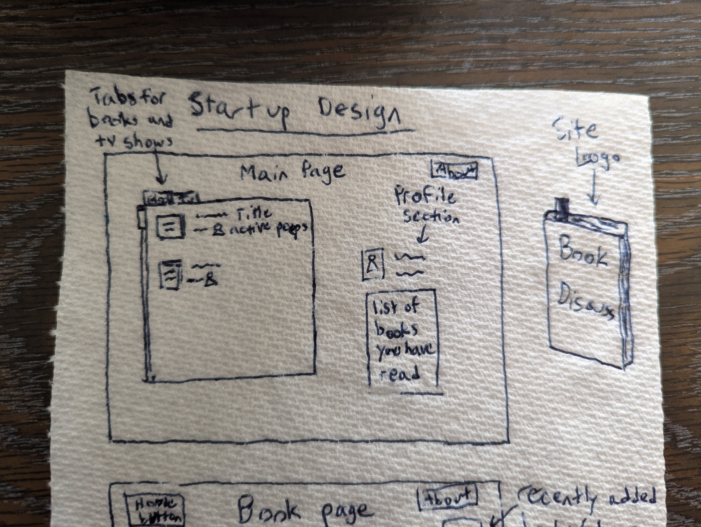

# startup
My primary repository

# Elevator Pitch:
Have you ever wanted to talk about a book that you really enjoy but nobody around you has read it or already knows the ending? Well fear not, for this application is here to help your creative mind! Book discuss is an application dedicated to connecting you with others who are at the same part of the book and therefore cannot spoil it but will have a genuine discussion with you. Especially useful for individuals who wish to create their own spinoff stories, such as authors and dungeon masters. The best part is that this application is dedicated to being spoiler free, so you can discuss away with others without anyone actually knowing the end and thus ruining the book. (Potentially can also work with tv shows).

# Design

# Key Features
 - Ability to connect to other users through a secure login
 - Ability to select the book/tv show to discuss
 - Display of already entered books and tv shows
 - Ability to set where user is at with chosen media
 - Results and chats are stored
 - Users are able to chat with one another
 - Ability for admin to moderate chats

# Technology Used
 - *HTML*: Uses HTML to build the application. Multiple HTML pages, one for login, one for the main page (where the books/shows are listed), one for a how-to page, and one for each book/show. Uses hyperlinks to move between pages.
 - *CSS*: Stylize screen to allow for different resolutions/screen sizes, adds color to denote different sections (ex. books vs shows). Uses contrast to make navigating the site easier.
 - *React*: Provides a login, already entered books/shows, conversations, user comments/where they are in the book/show, and use of React for routing. (I am unsure of the capabilities of React at this point to explain it further.)
 - *Service*: Backend service with endpoints for:  
        > Login  
        > Retrieving comments and profile stats  
        > Submitting responses  
        > Submitting books/shows  
 - *DB/Login*: Stores logins, comments, where in the book/show, registers new users, limits user options until logged in.
 - *WebSocket*: Sends user's replies and comments to other users in the same chat.

 ---------------------------------------------------------------------------------------------------------------
 # HTML Deliverable
- *HTML Pages*: Added a page for Index, Main, Book, and About.
- *Links*: Each page has About, Main, and Index (login) hyperlinked. Book is hyperlinked in Main.
- *Text*: About is filled with text; the username display currently has a text standin on the Main page.
- *Images*: Images were added to the Book and About page. I was unable to get the .ico file to work.
- *DB/Login*: Added standin html for login and username, username and password boxes require at least a character to tranfer user to Main.
- *Websocket*: Standin chat was added to Book html in place of future WebSocket chat function.

----------------------------------------------------------------------------------------------------------------
# CSS Deliverable
- *Header/Footer/Main*: Styled the pages to desired colors and setup.
- *Navigation*: I kept the HTML navigation because I like the look.
- *Portrait/Landscape Mode*: The only page that required switching between was the Book pages and the chats look good in both sides.
- *Application elements*: I filled the area and used a lightcoral background color for all pages.
- *Application text*: Consistent fonts were used on all pages.
- *Application images*: The book image on Book.html was stylized to center if the application was put in portrait mode, the whitespace around it in portait mode is intended.

----------------------------------------------------------------------------------------------------------------
# React Deliverable
- *Components*: Login, Main, About, Book
       - Login: I updated login with the authenticated/unathenticated files and it now saves your username.
       - Main: Main now shows only shows when authenticated and shows the saved username at the top of the page.
       - About: Nothing really to say about About, I fixed it to look the same with react as it did with CSS.
       - Book: Fixed the placeholder chat and picture and started a function (not saved on this repository yet) that will be implemented when clicking the chat button, but I was unable to finish it hence why it is not in the repository yet.
              - I also added Book2.js so that in the future I can have two separate books for my startup to begin with. 
- *Routing*: Main is now hidden behind the authentication and app.js now pulls from the .js file for each page and not the html file. I did save a couple html files because I wanted to be able to see the progress I made (the other ones that are missing did not change between html to js).
- *Navigation*: After seeing the example Simon navigation bar, I decided to use the same concept because it looks a lot better than mine did.
----------------------------------------------------------------------------------------------------------------
# Service Deliverable
- *Node.js/Express HTTP Service*: Created!
- *Backend service endpoints*: I have placeholders for the login, but I have not yet implemented the endpoint for chatting (I am still working on the chat function from the React deliverable).
- *Frontend service*: I added a fetch function to accomplish this.
I am still working on getting the chat table to show as I properly want it too. I am going to be out of town this weekend so I will probably not have it done by this saturday.
----------------------------------------------------------------------------------------------------------------
# Login Deliverable
- *Database*: I created a MongoDB account and cluster and was able to connect to it through my terminal. I added the files to connect to the database.
-------------------------------------------------------------------------------------------------------------------
# WebSocket Deliverable
- *Listening*: Backend listening has been added. It's done! I am happy with where it is at!